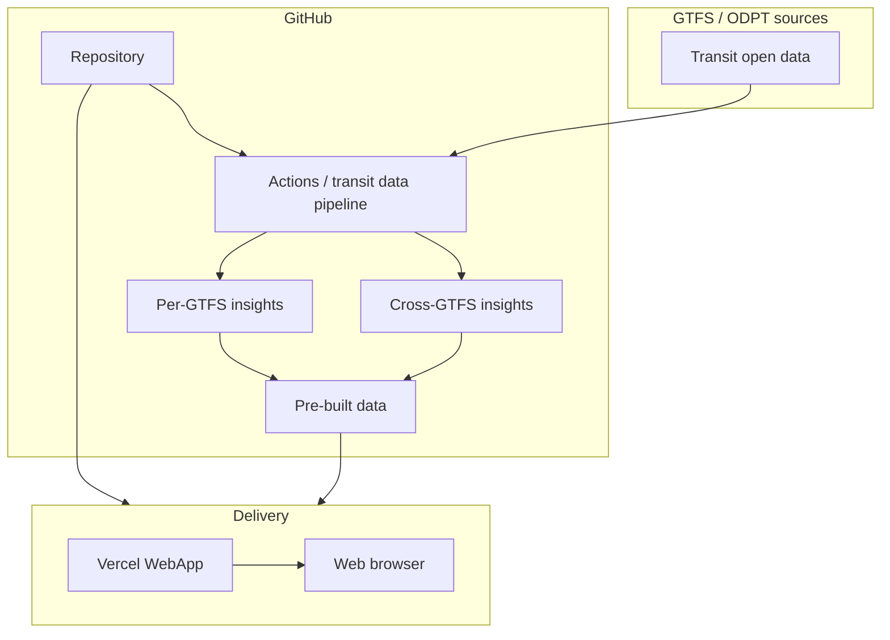

# System Architecture

Athenai は frontend-only の transit web app です。GitHub Actions で公共交通データを取得・加工し、生成した静的データと WebApp を Vercel から配信します。

## Deployment Diagram

```mermaid
graph TD
    subgraph DATA_SOURCES["GTFS / ODPT sources"]
        SOURCES["Transit open data"]
    end

    subgraph GITHUB["GitHub"]
        REPO["Repository"]
        PREBUILD["Actions / transit data pipeline"]
        GTFS_INSIGHTS["Per-GTFS insights"]
        CROSS_INSIGHTS["Cross-GTFS insights"]
        PREBUILT["Pre-built data"]

        REPO --> PREBUILD
        PREBUILD --> GTFS_INSIGHTS
        PREBUILD --> CROSS_INSIGHTS
        GTFS_INSIGHTS --> PREBUILT
        CROSS_INSIGHTS --> PREBUILT
    end

    subgraph DELIVERY["Delivery"]
        direction LR

        DEPLOY["Vercel WebApp"]
        BROWSER["Web browser"]
        DEPLOY --> BROWSER
    end

    SOURCES --> PREBUILD
    REPO --> DELIVERY
    PREBUILT --> DELIVERY
```
