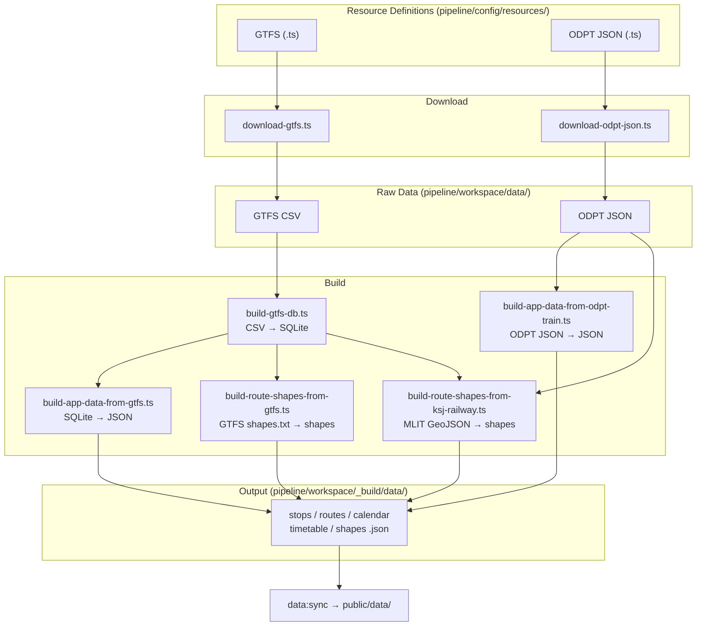

# Pipeline

GTFS / ODPT JSON データを取得し、WebApp 向けの JSON ファイルに変換するデータパイプライン。

WebApp (`src/`) とは独立しており、出力 JSON の型定義 (`src/types/data/transit-json.ts`) のみが両者の契約となる。

## Stage

パイプラインは3つの Stage で構成される。各 Stage は独立しており、前の Stage の出力を入力として受け取る。

| Stage | 概要                                            | 主な入力                                        | 主な出力                                   |
| ----- | ----------------------------------------------- | ----------------------------------------------- | ------------------------------------------ |
| 1     | **Download** — 外部 API からデータ取得          | 外部 API (ODPT 等)                              | `pipeline/workspace/data/` (CSV, JSON)     |
| 2     | **Build DB** — GTFS CSV → SQLite 変換           | `pipeline/workspace/data/gtfs/` (CSV)           | `pipeline/workspace/_build/db/*.db`        |
| 3     | **Build App Data** — アプリ用 JSON の生成と検証 | `pipeline/workspace/_build/db/*.db`, 静的データ | `pipeline/workspace/_build/data/{prefix}/` |

`public/data/` へのコピー (`npm run data:sync`) は WebApp 側の責務であり、pipeline の Stage には含まない。

## スクリプト

各スクリプトの詳細な仕様は `docs/` を参照。

| Stage | 概要                                  | スクリプト                                                            | npm script                              |
| ----- | ------------------------------------- | --------------------------------------------------------------------- | --------------------------------------- |
| 1     | GTFS ZIP をバッチダウンロード         | `scripts/pipeline/download-gtfs.ts`                                   | `npm run pipeline:download:gtfs`        |
| 1     | ODPT JSON をバッチダウンロード        | `scripts/pipeline/download-odpt-json.ts`                              | `npm run pipeline:download:odpt-json`   |
| 2     | GTFS CSV を SQLite に変換             | `scripts/pipeline/build-gtfs-db.ts`                                   | `npm run pipeline:build:db`             |
| 3     | SQLite からアプリ用 JSON を生成       | `scripts/pipeline/app-data-v1/build-app-data-from-gtfs.ts`            | `npm run pipeline:build:json`           |
| 3     | ODPT Train からアプリ用 JSON を生成   | `scripts/pipeline/app-data-v1/build-app-data-from-odpt-train.ts`      | `npm run pipeline:build:odpt-train`     |
| 3     | GTFS shapes.txt から路線形状を生成    | `scripts/pipeline/app-data-v1/build-route-shapes-from-gtfs.ts`        | `npm run pipeline:build:shapes:gtfs`    |
| 3     | 国土数値情報から鉄道路線形状を生成    | `scripts/pipeline/app-data-v1/build-route-shapes-from-ksj-railway.ts` | `npm run pipeline:build:shapes:ksj`     |
| 3     | v2 GTFS shapes.txt から路線形状を生成 | `scripts/pipeline/app-data-v2/build-shapes-from-gtfs.ts`              | `npm run pipeline:build:v2-shapes:gtfs` |
| 3     | v2 国土数値情報から鉄道路線形状を生成 | `scripts/pipeline/app-data-v2/build-shapes-from-ksj.ts`               | `npm run pipeline:build:v2-shapes:ksj`  |
| 3     | アプリ用 JSON の検証                  | `scripts/pipeline/app-data-v1/validate-app-data.ts`                   | `npm run pipeline:validate`             |
| -     | 全リソース定義の一覧表示              | `scripts/dev/describe-resources.ts`                                   | `npm run pipeline:describe`             |
| -     | ODPT リソース更新チェック             | `scripts/pipeline/check-odpt-resources.ts`                            | `npm run pipeline:check:odpt-resources` |

## 実行順序

フルビルド時の実行順序:

```bash
# Stage 1: Download
npm run pipeline:download:gtfs
npm run pipeline:download:odpt-json

# Stage 2: Build DB
npm run pipeline:build:db

# Stage 3: Build App Data
npm run pipeline:build:json
npm run pipeline:build:odpt-train
npm run pipeline:build:shapes:gtfs       # pipeline:build:json の後
npm run pipeline:build:shapes:ksj        # pipeline:build:json, :odpt-train の後
npm run pipeline:build:v2-shapes:gtfs    # pipeline:build:db の後
npm run pipeline:build:v2-shapes:ksj     # pipeline:build:db の後
npm run pipeline:validate

# public/ へコピー (pipeline スコープ外)
npm run data:sync
```

## 処理の流れ



`pipeline/workspace/_build/data/` が pipeline の最終出力。`public/data/` へのコピーは `npm run data:sync` の責務。

## リソース定義

各データソースは `pipeline/config/resources/` に TypeScript ファイルとして定義する。**ファイル名 (拡張子なし) がソース名**となり、CLI の引数や targets ファイルで使用する。

```plain
pipeline/config/resources/
├── gtfs/
│   ├── toei-bus.ts          → source-name: "toei-bus"
│   ├── toei-train.ts        → source-name: "toei-train"
│   └── suginami-gsm.ts      → source-name: "suginami-gsm"
└── odpt-json/
    ├── yurikamome-station.ts → source-name: "yurikamome-station"
    ├── yurikamome-railway.ts → source-name: "yurikamome-railway"
    └── yurikamome-station-timetable.ts
```

型構造と追加手順の詳細は [RESOURCE-DEFINITIONS.md](./docs/RESOURCE-DEFINITIONS.md) を参照。

## ドキュメント

| ドキュメント                                              | 概要                                                                                         |
| --------------------------------------------------------- | -------------------------------------------------------------------------------------------- |
| [DOWNLOADER.md](./docs/DOWNLOADER.md)                     | ダウンローダーの仕様 (CLI、バッチ、認証、リトライ、exit code)                                |
| [GTFS_TO_RDB.md](./docs/GTFS_TO_RDB.md)                   | GTFS CSV → SQLite 変換の仕様                                                                 |
| [APP_DATA_FROM_GTFS.md](./docs/APP_DATA_FROM_GTFS.md)     | SQLite → アプリ用 JSON 変換の仕様                                                            |
| [BUILD_TRAIN_SHAPES.md](./docs/BUILD_TRAIN_SHAPES.md)     | 鉄道路線形状生成の仕様                                                                       |
| [VALIDATE.md](./docs/VALIDATE.md)                         | アプリ用 JSON 検証の仕様 (ディレクトリ検査、ファイル存在チェック、カレンダー鮮度、exit code) |
| [DESCRIBE_RESOURCES.md](./docs/DESCRIBE_RESOURCES.md)     | リソース定義一覧表示の仕様                                                                   |
| [RESOURCE-DEFINITIONS.md](./docs/RESOURCE-DEFINITIONS.md) | リソース定義の型構造と追加手順                                                               |

### 運用ツール

| ツール                                  | 概要                                                                                                                                                                                                                                      |
| --------------------------------------- | ----------------------------------------------------------------------------------------------------------------------------------------------------------------------------------------------------------------------------------------- |
| `npm run pipeline:check:odpt-resources` | ODPT Members Portal API でリソース更新をチェック。ローカルの download-meta と比較し、期限切れ (EXPIRED)、削除 (REMOVED)、期限切れ間近 (EXPIRING_SOON)、新リソース (NEW_RESOURCE) を検知。CI で daily 実行 (`check-transit-resources.yml`) |
| `npm run pipeline:dev-tools`            | 分析スクリプトのインタラクティブ選択実行                                                                                                                                                                                                  |

## ディレクトリ構造

```plain
pipeline/
├── config/              Configuration (git managed)
│   ├── resources/       Resource definitions per data source
│   │   ├── gtfs/        GTFS source definitions (.ts)
│   │   └── odpt-json/   ODPT JSON source definitions (.ts)
│   └── targets/         Batch target lists (.ts) for --targets option
├── src/                 Internal code
│   ├── lib/             Shared libraries
│   │   ├── download/    Download utilities (download-utils, download-meta)
│   │   ├── resources/   Resource definition loaders (load-*-sources)
│   │   ├── pipeline/    Pipeline-specific libs (CLI utils, GTFS schema, v2 builders, shape extractors)
│   │   └── *.ts         Common utilities (paths, format, fs, time, calendar)
│   └── types/           Type definitions (resource-common, gtfs-resource, odpt-train)
├── scripts/             Entry points (thin scripts)
│   ├── pipeline/        CI/production pipeline
│   │   ├── app-data-v1/ v1 JSON builders + shapes + validate
│   │   ├── app-data-v2/ v2 JSON builders + shapes
│   │   └── *.ts         Download, build-db, check-resources
│   └── dev/             Development/analysis tools (manual execution only)
│       └── dev-lib/     Dev-only libraries (analysis, normalize)
├── workspace/           Pipeline I/O data
│   ├── data/            Downloaded raw data (re-downloadable, gitignored)
│   ├── _build/          Build output (generated, gitignored)
│   ├── _archives/       Timestamped download archives (gitignored)
│   └── state/           Operational state (git managed)
└── docs/                Design documents
```
