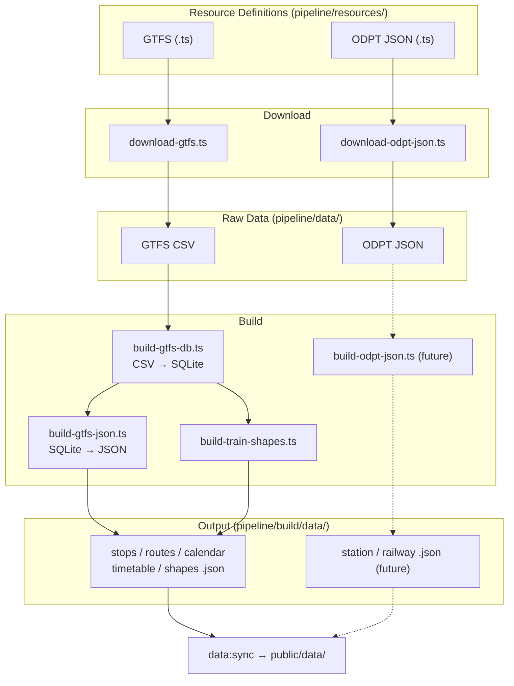

# Pipeline

GTFS / ODPT JSON データを取得し、WebApp 向けの JSON ファイルに変換するデータパイプライン。

WebApp (`src/`) とは独立しており、出力 JSON の型定義 (`src/types/data/transit-json.ts`) のみが両者の契約となる。

## ドキュメント

- [DOWNLOADER.md](./docs/DOWNLOADER.md) -- ダウンローダーの仕様 (CLI、バッチ、認証、リトライ、exit code)
- [GTFS_TO_RDB.md](./docs/GTFS_TO_RDB.md) -- GTFS CSV → SQLite 変換の仕様
- [JSON_FOR_APP.md](./docs/JSON_FOR_APP.md) -- SQLite → アプリ用 JSON 変換の仕様
- [BUILD_TRAIN_SHAPES.md](./docs/BUILD_TRAIN_SHAPES.md) -- 鉄道路線形状生成の仕様
- [VALIDATE.md](./docs/VALIDATE.md) -- 生成データ検証の仕様 (ファイル存在チェック、カレンダー鮮度、exit code)
- [DESCRIBE_RESOURCES.md](./docs/DESCRIBE_RESOURCES.md) -- リソース定義一覧表示の仕様
- [RESOURCE-DEFINITIONS.md](./docs/RESOURCE-DEFINITIONS.md) -- リソース定義の型構造と追加手順
- [DATA-PIPELINE.md](./DATA-PIPELINE.md) -- パイプラインの実行手順とステップ詳細

## スクリプト

| スクリプト                           | npm script                            | 概要                               |
| ------------------------------------ | ------------------------------------- | ---------------------------------- |
| `scripts/download-gtfs.ts`           | `npm run pipeline:download:gtfs`      | GTFS ZIP をバッチダウンロード      |
| `scripts/download-odpt-json.ts`      | `npm run pipeline:download:odpt-json` | ODPT JSON をバッチダウンロード     |
| `scripts/build-gtfs-db.ts`           | `npm run pipeline:build:db`           | GTFS CSV を SQLite に変換          |
| `scripts/build-gtfs-json.ts`         | `npm run pipeline:build:json`         | SQLite からアプリ用 JSON を生成    |
| `scripts/build-train-shapes.ts`      | `npm run pipeline:build:train-shapes` | 国土数値情報から鉄道路線形状を生成 |
| `scripts/validate-generated-data.ts` | `npm run pipeline:validate`           | 生成データの検証                   |
| `scripts/describe-resources.ts`      | `npm run pipeline:describe`           | 全リソース定義の一覧表示           |

## 処理の流れ



`pipeline/build/data/` が pipeline の最終出力。`public/data/` へのコピーは `npm run data:sync` の責務。

## ダウンロード

### 実行方法

```bash
# バッチ実行 (targets ファイルに定義されたソースを全て実行)
npm run pipeline:download:gtfs
npm run pipeline:download:odpt-json

# 単体実行
npx tsx pipeline/scripts/download-gtfs.ts toei-bus
npx tsx --env-file=pipeline/.env.pipeline.local pipeline/scripts/download-odpt-json.ts yurikamome-station

# ソース一覧表示
npx tsx pipeline/scripts/download-gtfs.ts --list
npx tsx pipeline/scripts/download-odpt-json.ts --list
```

### 認証

ODPT API の認証が必要なソースは `ODPT_ACCESS_TOKEN` 環境変数を参照する。

- **ローカル**: `pipeline/.env.pipeline.local` にトークンを記述。npm script は `--env-file-if-exists` で自動読み込み。
- **CI**: GitHub Actions secrets から `env:` で注入。`.env` ファイルは使わない。

```bash
# pipeline/.env.pipeline.local (gitignored)
ODPT_ACCESS_TOKEN=your-token-here
```

トークンは [ODPT Developer](https://developer.odpt.org/) で取得。

### バッチ実行

`--targets <file>` オプションで、TypeScript ファイルに定義されたソースを順次実行する。

```bash
npx tsx pipeline/scripts/download-gtfs.ts --targets pipeline/targets/download-gtfs.ts
```

targets ファイルは `string[]` を `export default` する:

```typescript
// pipeline/targets/download-gtfs.ts
export default [
    'toei-bus',
    'toei-train',
    // 'suginami-gsm',  // コメントアウトで一時スキップ
];
```

各ソースは独立した子プロセスで実行される。1つが失敗しても後続は継続する。

### Exit Code

| code | 意味                       | CI での挙動    |
| ---- | -------------------------- | -------------- |
| 0    | 全て成功 (ok)              | 続行           |
| 1    | 部分失敗 (partial failure) | 続行 (warning) |
| 2    | 全て失敗 (all failed)      | 停止           |

単体実行では 0 (ok) または 1 (error) のみ。

### 出力

ダウンロードしたファイルは2箇所に保存される:

- `pipeline/data/` -- 最新データ (build ステップの入力)
- `pipeline/archives/` -- タイムスタンプ付きアーカイブ (履歴保存)

## リソース定義

各データソースは `pipeline/resources/` に TypeScript ファイルとして定義する。**ファイル名 (拡張子なし) がソース名**となり、CLI の引数や targets ファイルで使用する。

```
pipeline/resources/
├── gtfs/
│   ├── toei-bus.ts          → source-name: "toei-bus"
│   ├── toei-train.ts        → source-name: "toei-train"
│   └── suginami-gsm.ts      → source-name: "suginami-gsm"
└── odpt-json/
    ├── yurikamome-station.ts → source-name: "yurikamome-station"
    ├── yurikamome-railway.ts → source-name: "yurikamome-railway"
    └── yurikamome-station-timetable.ts
```

### 型構造

全てのリソース定義は `BaseResource` を共通基盤とする:

```
BaseResource (resource-common.ts)
├── GtfsResource (gtfs-resource.ts)         — downloadUrl, routeTypes
└── OdptJsonResource (odpt-json-resource.ts) — endpointUrl, odptType
```

各定義ファイルは `{ resource, pipeline }` の構造で `export default` する:

- `resource` -- データソースのメタデータ (名前、プロバイダ、ライセンス、認証、エンドポイント等)
- `pipeline` -- パイプライン処理設定 (`outDir`, `prefix`, `outFileName?`)

### 新しいソースの追加手順

1. `pipeline/resources/gtfs/` または `pipeline/resources/odpt-json/` に定義ファイルを作成
2. `pipeline/targets/` の該当ファイルにソース名を追加
3. `npx tsx pipeline/scripts/download-*.ts <source-name>` で単体テスト
4. バッチ実行で確認

## ディレクトリ構造

```
pipeline/
├── types/          Type definitions (resource-common, gtfs-resource, odpt-json-resource)
├── resources/      Resource definitions per data source (git managed)
│   ├── gtfs/       GTFS source definitions (.ts)
│   └── odpt-json/  ODPT JSON source definitions (.ts)
├── targets/        Batch target lists (.ts) for --targets option
├── lib/            Shared utilities (download-utils)
├── data/           Downloaded raw data (re-downloadable, not git managed)
│   ├── gtfs/       Extracted GTFS CSV files
│   └── odpt-json/  ODPT JSON files
├── archives/       Timestamped archives of downloaded files (gitignored)
├── build/          Build output (generated, gitignored)
│   └── data/       JSON files for the web app
├── scripts/        Pipeline scripts
└── docs/           Design documents
```
