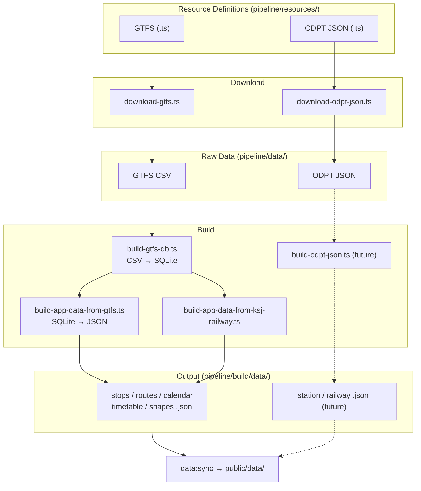

# Pipeline

GTFS / ODPT JSON データを取得し、WebApp 向けの JSON ファイルに変換するデータパイプライン。

WebApp (`src/`) とは独立しており、出力 JSON の型定義 (`src/types/data/transit-json.ts`) のみが両者の契約となる。

## Stage

パイプラインは3つの Stage で構成される。各 Stage は独立しており、前の Stage の出力を入力として受け取る。

| Stage | 概要                                            | 主な入力                          | 主な出力                        |
| ----- | ----------------------------------------------- | --------------------------------- | ------------------------------- |
| 1     | **Download** — 外部 API からデータ取得          | 外部 API (ODPT 等)                | `pipeline/data/` (CSV, JSON)    |
| 2     | **Build DB** — GTFS CSV → SQLite 変換           | `pipeline/data/gtfs/` (CSV)       | `pipeline/build/*.db`           |
| 3     | **Build App Data** — アプリ用 JSON の生成と検証 | `pipeline/build/*.db`, 静的データ | `pipeline/build/data/{prefix}/` |

`public/data/` へのコピー (`npm run data:sync`) は WebApp 側の責務であり、pipeline の Stage には含まない。

## スクリプト

各スクリプトの詳細な仕様は `docs/` を参照。

| Stage | 概要                               | スクリプト                                   | npm script                            |
| ----- | ---------------------------------- | -------------------------------------------- | ------------------------------------- |
| 1     | GTFS ZIP をバッチダウンロード      | `scripts/download-gtfs.ts`                   | `npm run pipeline:download:gtfs`      |
| 1     | ODPT JSON をバッチダウンロード     | `scripts/download-odpt-json.ts`              | `npm run pipeline:download:odpt-json` |
| 2     | GTFS CSV を SQLite に変換          | `scripts/build-gtfs-db.ts`                   | `npm run pipeline:build:db`           |
| 3     | SQLite からアプリ用 JSON を生成    | `scripts/build-app-data-from-gtfs.ts`        | `npm run pipeline:build:json`         |
| 3     | 国土数値情報から鉄道路線形状を生成 | `scripts/build-app-data-from-ksj-railway.ts` | `npm run pipeline:build:train-shapes` |
| 3     | アプリ用 JSON の検証               | `scripts/validate-app-data.ts`               | `npm run pipeline:validate`           |
| -     | 全リソース定義の一覧表示           | `scripts/describe-resources.ts`              | `npm run pipeline:describe`           |

## 実行順序

フルビルド時の実行順序:

```bash
# Stage 1: Download
npm run pipeline:download:gtfs
npm run pipeline:download:odpt-json

# Stage 2: Build DB
npm run pipeline:build:db

# Stage 3: Build App Data
npm run pipeline:build:json
npm run pipeline:build:train-shapes      # pipeline:build:json の後
npm run pipeline:validate

# public/ へコピー (pipeline スコープ外)
npm run data:sync
```

## 処理の流れ



`pipeline/build/data/` が pipeline の最終出力。`public/data/` へのコピーは `npm run data:sync` の責務。

## リソース定義

各データソースは `pipeline/resources/` に TypeScript ファイルとして定義する。**ファイル名 (拡張子なし) がソース名**となり、CLI の引数や targets ファイルで使用する。

```plain
pipeline/resources/
├── gtfs/
│   ├── toei-bus.ts          → source-name: "toei-bus"
│   ├── toei-train.ts        → source-name: "toei-train"
│   └── suginami-gsm.ts      → source-name: "suginami-gsm"
└── odpt-json/
    ├── yurikamome-station.ts → source-name: "yurikamome-station"
    ├── yurikamome-railway.ts → source-name: "yurikamome-railway"
    └── yurikamome-station-timetable.ts
```

型構造と追加手順の詳細は [RESOURCE-DEFINITIONS.md](./docs/RESOURCE-DEFINITIONS.md) を参照。

## ドキュメント

| ドキュメント                                              | 概要                                                                       |
| --------------------------------------------------------- | -------------------------------------------------------------------------- |
| [DOWNLOADER.md](./docs/DOWNLOADER.md)                     | ダウンローダーの仕様 (CLI、バッチ、認証、リトライ、exit code)              |
| [GTFS_TO_RDB.md](./docs/GTFS_TO_RDB.md)                   | GTFS CSV → SQLite 変換の仕様                                               |
| [APP_DATA_FROM_GTFS.md](./docs/APP_DATA_FROM_GTFS.md)     | SQLite → アプリ用 JSON 変換の仕様                                          |
| [BUILD_TRAIN_SHAPES.md](./docs/BUILD_TRAIN_SHAPES.md)     | 鉄道路線形状生成の仕様                                                     |
| [VALIDATE.md](./docs/VALIDATE.md)                         | アプリ用 JSON 検証の仕様 (ファイル存在チェック、カレンダー鮮度、exit code) |
| [DESCRIBE_RESOURCES.md](./docs/DESCRIBE_RESOURCES.md)     | リソース定義一覧表示の仕様                                                 |
| [RESOURCE-DEFINITIONS.md](./docs/RESOURCE-DEFINITIONS.md) | リソース定義の型構造と追加手順                                             |

## ディレクトリ構造

```plain
pipeline/
├── types/          Type definitions (resource-common, gtfs-resource, odpt-json-resource)
├── resources/      Resource definitions per data source (git managed)
│   ├── gtfs/       GTFS source definitions (.ts)
│   └── odpt-json/  ODPT JSON source definitions (.ts)
├── targets/        Batch target lists (.ts) for --targets option
├── lib/            Shared utilities (download-utils)
├── data/           Downloaded raw data (re-downloadable, not git managed)
│   ├── gtfs/       Extracted GTFS CSV files
│   └── odpt-json/  ODPT JSON files
├── archives/       Timestamped archives of downloaded files (gitignored)
├── build/          Build output (generated, gitignored)
│   └── data/       JSON files for the web app
├── scripts/        Pipeline scripts
└── docs/           Design documents
```
