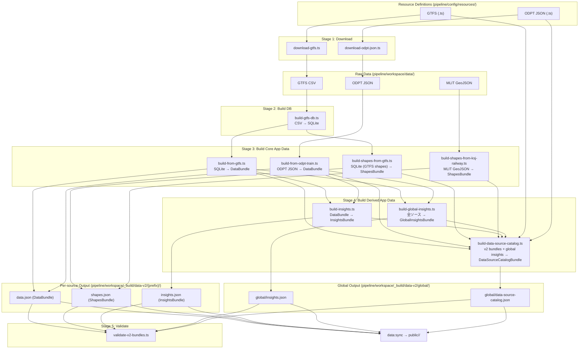

# Pipeline

GTFS / ODPT JSON データを取得し、WebApp 向けの JSON ファイルに変換するデータパイプライン。

WebApp (`src/`) とは独立しており、出力 JSON の型定義 (`contracts/data/transit-json.ts`, `contracts/data/transit-v2-json.ts`, `contracts/data/transit-v2-catalog-json.ts`) が両者の契約となる。

## GTFS-JP の version 状況

GTFS-JP は 2026 年に国土交通省から **v4 が公開された** (=「公共交通運行情報標準データ仕様 (GTFS-JP)」 として再構成、GTFS Schedule 日本標準仕様書 v4)。ただし実データの配布形式は過渡期にあり、既存の **GTFS-JP v3 様式で提供される feed** も多い。当パイプラインは v4 を baseline として設計しつつ、v3 様式 feed との後方互換性も維持する。

## Stage

パイプライン本体は 5 つの Stage で構成される。各 Stage は前段の出力を入力として受け取る。

| Stage | 概要                                                            | 主な入力                                                                                                                                                 | 主な出力                                                                                   |
| ----- | --------------------------------------------------------------- | -------------------------------------------------------------------------------------------------------------------------------------------------------- | ------------------------------------------------------------------------------------------ |
| 1     | **Download** — 外部 API からデータ取得                          | 外部 API (ODPT 等)                                                                                                                                       | `pipeline/workspace/data/` (CSV, JSON)                                                     |
| 2     | **Build DB** — GTFS CSV → SQLite 変換                           | `pipeline/workspace/data/gtfs/` (CSV)                                                                                                                    | `pipeline/workspace/_build/db/*.db`                                                        |
| 3     | **Build Core App Data** — 基礎 bundle 生成                      | `pipeline/workspace/_build/db/*.db`, 静的データ, ODPT JSON                                                                                               | `pipeline/workspace/_build/data-v2/{prefix}/`                                              |
| 4     | **Build Derived App Data** — 派生 bundle / global artifact 生成 | `pipeline/workspace/_build/data-v2/{prefix}/{data,insights,shapes}.json`, `pipeline/workspace/_build/data-v2/global/insights.json`, resource definitions | `pipeline/workspace/_build/data-v2/{prefix}/`, `pipeline/workspace/_build/data-v2/global/` |
| 5     | **Validate** — v2 bundle / global artifact 検証                 | `pipeline/workspace/_build/data-v2/{prefix}/`, `pipeline/workspace/_build/data-v2/global/`                                                               | 検証ログ                                                                                   |

`public/<PIPELINE_TRANSIT_DATA_DIR>/` へのコピー (`npm run data:sync`, default: `public/data-v2/`) は WebApp 側の責務であり、pipeline の Stage には含まない。

## スクリプト

各スクリプトの詳細な仕様は `docs/` を参照。

| Stage | 概要                           | スクリプト                                                      | npm script                                      |
| ----- | ------------------------------ | --------------------------------------------------------------- | ----------------------------------------------- |
| 1     | GTFS ZIP をバッチダウンロード  | `scripts/pipeline/download-gtfs.ts`                             | `npm run pipeline:download:gtfs`                |
| 1     | ODPT JSON をバッチダウンロード | `scripts/pipeline/download-odpt-json.ts`                        | `npm run pipeline:download:odpt-json`           |
| 2     | GTFS CSV を SQLite に変換      | `scripts/pipeline/build-gtfs-db.ts`                             | `npm run pipeline:build:db`                     |
| 3     | DataBundle を生成 (GTFS)       | `scripts/pipeline/app-data-v2/build-from-gtfs.ts`               | `npm run pipeline:build:v2-data`                |
| 3     | DataBundle を生成 (ODPT Train) | `scripts/pipeline/app-data-v2/build-from-odpt-train.ts`         | `npm run pipeline:build:v2-odpt-train`          |
| 3     | ShapesBundle を生成 (GTFS)     | `scripts/pipeline/app-data-v2/build-shapes-from-gtfs.ts`        | `npm run pipeline:build:v2-shapes:gtfs`         |
| 3     | ShapesBundle を生成 (KSJ)      | `scripts/pipeline/app-data-v2/build-shapes-from-ksj-railway.ts` | `npm run pipeline:build:v2-shapes:ksj`          |
| 4     | InsightsBundle を生成          | `scripts/pipeline/app-data-v2/build-insights.ts`                | `npm run pipeline:build:v2-insights`            |
| 4     | GlobalInsightsBundle を生成    | `scripts/pipeline/app-data-v2/build-global-insights.ts`         | `npm run pipeline:build:v2-global-insights`     |
| 4     | DataSourceCatalogBundle を生成 | `scripts/pipeline/app-data-v2/build-data-source-catalog.ts`     | `npm run pipeline:build:v2-data-source-catalog` |
| 5     | バンドルの検証                 | `scripts/pipeline/app-data-v2/validate-v2-bundles.ts`           | `npm run pipeline:validate:v2`                  |
| -     | 全リソース定義の一覧表示       | `scripts/dev/describe-resources.ts`                             | `npm run pipeline:describe`                     |
| -     | ODPT リソース更新チェック      | `scripts/pipeline/check-odpt-resources.ts`                      | `npm run pipeline:check:odpt-resources`         |

**Note**: v1 スクリプト (`scripts/pipeline/app-data-v1/`) は残存しているが、v1 出力を消費する WebApp コードは削除済みのため、実行しても意味がない。

## 実行順序

フルビルド時の実行順序:

```bash
# Stage 1: Download
npm run pipeline:download:gtfs
npm run pipeline:download:odpt-json

# Stage 2: Build DB
npm run pipeline:build:db

# Stage 3: Build Core App Data (v2)
npm run pipeline:build:v2-data           # DB の後
npm run pipeline:build:v2-odpt-train     # ODPT JSON の後
npm run pipeline:build:v2-shapes:gtfs    # DB の後
npm run pipeline:build:v2-shapes:ksj     # MLIT GeoJSON 取得後

# Stage 4: Build Derived App Data (v2)
npm run pipeline:build:v2-insights       # v2 DataBundle の後
npm run pipeline:build:v2-global-insights # v2 DataBundle (全ソース) の後
npm run pipeline:build:v2-data-source-catalog # v2 bundle 群 + global/insights.json の後

# Stage 5: Validate
npm run pipeline:validate:v2

# public/ へコピー (pipeline スコープ外)
npm run data:sync
```

## 処理の流れ



## リソース定義

各データソースは `pipeline/config/resources/` に TypeScript ファイルとして定義する。**ファイル名 (拡張子なし) がソース名**となり、CLI の引数や targets ファイルで使用する。

```plain
pipeline/config/resources/
├── gtfs/
│   ├── toei-bus.ts          → source-name: "toei-bus"
│   ├── toei-train.ts        → source-name: "toei-train"
│   └── suginami-gsm.ts      → source-name: "suginami-gsm"
└── odpt-json/
    ├── yurikamome-station.ts → source-name: "yurikamome-station"
    ├── yurikamome-railway.ts → source-name: "yurikamome-railway"
    └── yurikamome-station-timetable.ts
```

型構造と追加手順の詳細は [RESOURCE-DEFINITIONS.md](./docs/RESOURCE-DEFINITIONS.md) を参照。

## ドキュメント

| ドキュメント                                                              | 概要                                                          |
| ------------------------------------------------------------------------- | ------------------------------------------------------------- |
| [DOWNLOADER.md](./docs/DOWNLOADER.md)                                     | ダウンローダーの仕様 (CLI、バッチ、認証、リトライ、exit code) |
| [GTFS_TO_RDB.md](./docs/GTFS_TO_RDB.md)                                   | GTFS CSV → SQLite 変換の仕様                                  |
| [V1_APP_DATA_FROM_GTFS.md](./docs/v1-archive/V1_APP_DATA_FROM_GTFS.md)    | (v1, archive) SQLite → アプリ用 JSON 変換の仕様               |
| [V1_BUILD_TRAIN_SHAPES.md](./docs/v1-archive/V1_BUILD_TRAIN_SHAPES.md)    | (v1, archive) 鉄道路線形状生成の仕様                          |
| [V1_VALIDATE.md](./docs/v1-archive/V1_VALIDATE.md)                        | (v1, archive) アプリ用 JSON 検証の仕様                        |
| [V2_APP_DATA.md](./docs/V2_APP_DATA.md)                                   | (v2) DataBundle ビルド仕様                                    |
| [V2_BUILD_SHAPES.md](./docs/V2_BUILD_SHAPES.md)                           | (v2) ShapesBundle ビルド仕様                                  |
| [V2_BUILD_INSIGHTS.md](./docs/V2_BUILD_INSIGHTS.md)                       | (v2) InsightsBundle ビルド仕様                                |
| [V2_BUILD_GLOBAL_INSIGHTS.md](./docs/V2_BUILD_GLOBAL_INSIGHTS.md)         | (v2) GlobalInsightsBundle ビルド仕様                          |
| [V2_BUILD_DATA_SOURCE_CATALOG.md](./docs/V2_BUILD_DATA_SOURCE_CATALOG.md) | (v2) DataSourceCatalogBundle ビルド仕様                       |
| [V2_VALIDATE.md](./docs/V2_VALIDATE.md)                                   | (v2) バンドル検証仕様                                         |
| [PIPELINE-BENCHMARKS.md](./docs/PIPELINE-BENCHMARKS.md)                   | パイプライン実行時間計測                                      |
| [DESCRIBE_RESOURCES.md](./docs/DESCRIBE_RESOURCES.md)                     | リソース定義一覧表示の仕様                                    |
| [RESOURCE-DEFINITIONS.md](./docs/RESOURCE-DEFINITIONS.md)                 | リソース定義の型構造と追加手順                                |

### 運用ツール

| ツール                                  | 概要                                                                                                                                                                                                                                      |
| --------------------------------------- | ----------------------------------------------------------------------------------------------------------------------------------------------------------------------------------------------------------------------------------------- |
| `npm run pipeline:check:odpt-resources` | ODPT Members Portal API でリソース更新をチェック。ローカルの download-meta と比較し、期限切れ (EXPIRED)、削除 (REMOVED)、期限切れ間近 (EXPIRING_SOON)、新リソース (NEW_RESOURCE) を検知。CI で daily 実行 (`check-transit-resources.yml`) |
| `npm run pipeline:dev-tools`            | 分析スクリプトのインタラクティブ選択実行                                                                                                                                                                                                  |

## ディレクトリ構造

```plain
pipeline/
├── config/              Configuration (git managed)
│   ├── resources/       Resource definitions per data source
│   │   ├── gtfs/        GTFS source definitions (.ts)
│   │   └── odpt-json/   ODPT JSON source definitions (.ts)
│   └── targets/         Batch target lists (.ts) for --targets option
├── src/                 Internal code
│   ├── lib/             Shared libraries
│   │   ├── download/    Download utilities (download-utils, download-meta)
│   │   ├── resources/   Resource definition loaders (load-*-sources)
│   │   ├── pipeline/    Pipeline-specific libs (CLI utils, GTFS schema, v2 builders, shape extractors)
│   │   └── *.ts         Common utilities (paths, format, fs, time, calendar)
│   └── types/           Type definitions (resource-common, gtfs-resource, odpt-train)
├── scripts/             Entry points (thin scripts)
│   ├── pipeline/        CI/production pipeline
│   │   ├── app-data-v1/ v1 JSON builders + shapes + validate (unused, archive)
│   │   ├── app-data-v2/ v2 JSON builders + shapes
│   │   └── *.ts         Download, build-db, check-resources
│   └── dev/             Development/analysis tools (manual execution only)
│       └── dev-lib/     Dev-only libraries (analysis, normalize)
├── workspace/           Pipeline I/O data
│   ├── data/            Downloaded raw data (re-downloadable, gitignored)
│   ├── _build/          Build output (generated, gitignored)
│   ├── _archives/       Timestamped download archives (gitignored)
│   └── state/           Operational state (git managed)
└── docs/                Design documents
```
